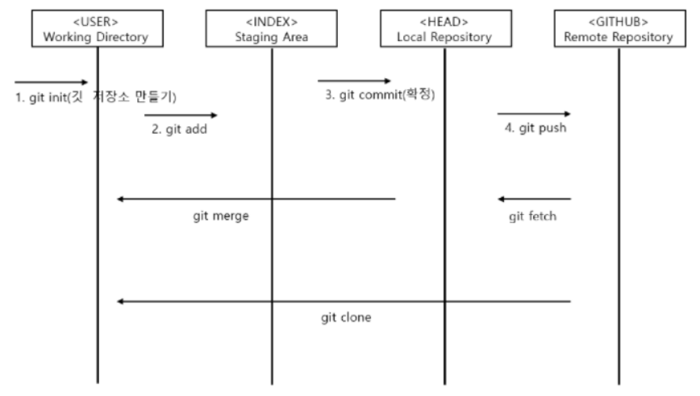
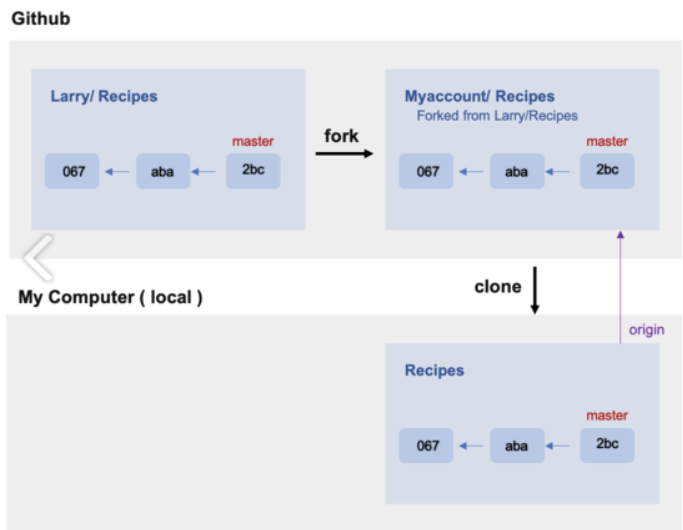

# git?
 - 소스 코드 **버전 관리 시스템**
 Git이 제공하는 핵심 기능은 크게 버전관리(Version Control), 백업(Backup), 협업(Collaboration)
 - 소스 코드 버전 사이를 오가는 기능을 제공
 - 데이터를 저장할 공간 O 
    - 시공간의 제약 X + 다른 사람과 버전 관리 가능
        - 많은 개발자가 Git으로 협업하는 이유
___

# github?
- 깃(Git)이라는 시스템을 기반
    - 소스코드와 관련 파일을 저장, 관리할 수 있는 웹 기반 호스팅 서비스를 제공
- 주요 특징
    - 버전관리, 협업, 이슈 트래킹, 웹 호스팅, 오픈소스 등
- GitHub에 소스 코드를 올림 => 시간, 공간의 제약 없이 협업 가능
- 프로젝트 -> 공개 저장소로 저장 => 모르는 개발자와 협업 가능 
    - 오픈 소스 : 공개 저장소 프로젝트


___

# git clone?
-  github와 같이 다른 git 저장소에서 사용자의 컴퓨터로 폴더를 **가져오기** 위해 사용
___

# git init?
- 프로젝트(소스코드들이 있는 디렉토리)를 **git repository로 만듦**
    - 디렉토리를 git repository로 만들어야 git으로 버전 관리를 할 수 있음
___
# git branch?
- **branch를 생성**

- master branch 
    - **기준**이 되는 큰 줄기
- feature branch  
    - 동일한 소스 코드에서 가져온 **독립적인 개발 라인**
    - 각각의 개발자로부터 나온 줄기들
    - 각각의 개발자가 master branch에서 checkout하고 자신만의 branch를 만듦
- **merge**
     - feature branch에서 master branch로 **합치는 과정**
        - 1. feature branch에서 각자 개발 
          2. commit 
          3. 자신의 feature branch를 master branch로 합침 
___

# git add?
- 파일의 수정 사항들(Modified)을 staged 상태로 변경
    - git에서는 untracked도 수정 사항이라고 인식함
        - untracked : 새로이 추가된 파일들은 파일
- git repository에 새로 추가된 파일들을 staged 상태로 옮김
- git add 명령어
    - ```$ git add <파일/디렉토리 경로>```
        - 작업 디렉토리의 **변경 내용**의 일부만 스테이징 영역에 넘김
        - 수정한 파일이나 디렉토리의 경로를 인자로 넘김
    - ```$ git add .```
        - **현재 디렉토리**의 **모든** 변경 내용을 스테이징 영역으로 넘기고 싶을 때
        - 명령어를 실행한 디렉토리 **이하**에서 발생한 변경 내용만 포함 
        - **git add .** 을 프로젝트 **최상위 디렉토리**에서 실행 **=** **git add -A**
___

# git commit?
- **staged 된 파일들 commit**
- 시간에 따라서 변화하는 내용만 관리
- 코드가 변화된 시간 순서에 따라서 영구적으로 저장
___

# git push?
- 로컬 브랜치(local branch)를 **원격 저장소(remote repository)로 푸시**할 때 사용
- branch에서 commit한 파일들을 원격 저장소로 보내 동일한 상태로 만들어줌
___

# git diff?
- 어떤 **수정 사항**들이 적용됐는지 **보여줌** 
    - **Modified 된 파일들만 볼 수 있음**
    - staged 된 수정 사항들은 볼 수 없음
___

# git status?
- **현재 상태**를 **보여줌**
    - 어떠한 파일들이 modified가 되었고 어떠한 파일들이 staged가 되었는지 등 전체적인 상황
- **git의 상태**
    - **Commited** : 데이터가 로컬 데이터베이스에 안전하게 **저장**됨
    - **Modified** : **수정한 파일**을 아직 로컬 데이터베이스에 **커밋하지 않은 상태**
    - **Staged** : 현재 수정한 파일을 **곧 커밋**할 것이라고 표시한 상태

- **git add** 명령어 사용할 때 **항상 함께** 사용
- **작업 디렉토리**(working directory)와 **스테이징 영역**(staging area)의 **상태를 확인**하기 위해서 사용
___

# Staging Area? 
- **작업 디렉토리**와 **Git 저장소**의 **변경 이력 사이** 에 **징검다리** 역할
    - 작업 디렉토리 : 아직 **커밋할 준비가 안**된 변경 내용을 자유롭게 **수정**할 수 있는 공간
- **커밋할 준비가 된** 변경 내용이Git 저장소에 **기록되기 전**에 **대기**하는 장소
- **현재 작업 디렉토리**에 있는 모든 또는 일부 **변경 내용**을 스테이징 영역으로 **이동**   
- 변경 이력을 남길 때 작업 디렉토리에 있는 변경 내용을 조금씩 **나누어** 기록할 수 있음
    - 각 변경 기록(commit)에 논리적으로 **하나의 변경 사항**을 담기가 용이
        - 버그 추적, 변경 이력을 롤백(roll back)할 때 이점 있음
___

# git log?
- Commit **내역**들을 보여줌
- Commit history라고도 함
- git log를 통해 이제까지 **커밋 내역**들을 전부 볼 수 있음
    - 다만 출력되는 포맷이 보기가 쉽지가 않음
        + tig 같은 tool을 사용 -> 훨씬 편리

___

# git rm
- git repository에서 원하는 **파일 삭제**

___

# git mv
- git repository 상에서 원하는 **파일 이동** 
- 파일의 **이름**을 **바꿀 수**도 있음

___

# git 명령어 사용
 **1. Fork**
    -  **다른 사람의 Github Repository**에서 내가 어떤 부분을 **수정**하거나 **추가** 기능을 넣고 싶을 때 **해당 repository**를 **내 Github Repository**로 그대로 **복제**하는 기능
    - 메인프로젝트에서 Fork를 누르면 자신의 계정에 새로운 저장소가 생김

**2. Fork한 Repository의 URL을 자신의 로컬 저장소에 clone 
    → 로컬 저장소에 원격 저장소 추가**
- git remote -v : 현재 연결된 원격 저장소 확인
- remove : 연결 해제

**3.  branch 명령어로 branch를 생성**
- 목적 : 원본 코드와 독립적으로 작업을 수행
- switch : 생성한 브랜치로 이동

**4. branch에서 작업 수행**
    →  자신의 github repository에 수정사항을 반영
   - add / commit / push 명령어 사용

**5. push**
→ 자신의 github repository에 Compare & pull request 버튼이 생김

**6. 검토 및 Merge pull request**
- PR을 받은 원본 저장소 관리자 : 코드 변경내역을 검토 및 Merge 여부 결정

**7. Merge 후 동기화 및 branch 삭제**
  
## example

1. Larry라는 사람의 Recipes 레포지토리에 Contributors로 등록이 되기 위해서는 먼저 나의 Github 저장소로 Fork
2. 나의 Github Repository에 있는 저장소를 나의 로컬 PC에다 clone을 받아서 복사
3. 로컬에서 본인이 원하는 내용을 수정
4. 원본 레포지토리에 Pull  Reqeust를 보내 레포지토리 주인의 승인을 기다림
