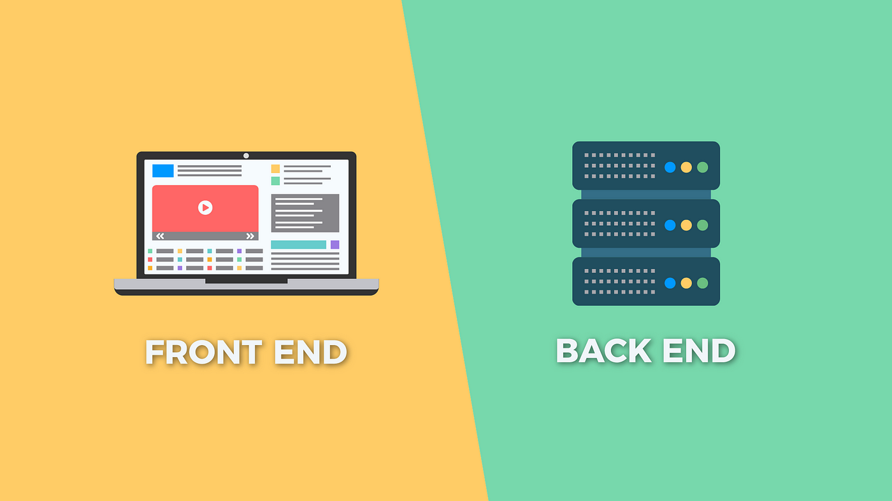

# 전공 소개

## Front-End Development
- 웹 사이트나 애플리케이션의 **사용자 인터페이스(UI)** 를 개발
- **사용자가 직접 상호 작용하는 부분을 다룸**
- 사용 언어 : HTML, CSS, JavaScript 등
- 프레임워크 : React, Vue.js, Angular
    ⇒ 더욱 동적이고, 효율적인 웹 애플리케이션을 개발하는 추세
- **주요 역할**
    - **UI 개발**: HTML, CSS, JavaScript 등 사용
        ⇒ 사용자에게 시각적으로 표현되는 웹 페이지 또는 애플리케이션을 디자인, 구현
    - **사용자 경험(UX) 개선** : 사용자의 편의성과 만족도를 높이기 위해 UI/UX 디자인에 초점을 둠
    - **클라이언트 사이드 로직** : 브라우저에서 실행되는 JS 사용
    - **웹 성능 최적화** : 웹 페이지의 로딩 시간 단축과 사용자 경험 향상을 위함

## Back-End Development
- **서버** 측에서 작동하는 애플리케이션의 로직과 데이터 처리를 담당
- 사용 언어 : Python, Java, Ruby, PHP, Node.js 등
- **데이터베이스**와의 ⇒ **상호 작용** ⇒ 사용자 요청 처리, 응답 생성
- 주요한 프레임워크 : Django, Spring, Express 등
- **주요 역할**
    - **서버 구축** : 서버를 설정, 관리
        ⇒ 클라이언트의 요청을 처리, 응답
    - **데이터 관리** : 데이터베이스를 설계, 관리
        ⇒ 데이터를 저장, 수정, 삭제, 조회
    - **비즈니스 로직 구현** : 프로젝트의 핵심 비즈니스 로직 구현, 제어
    - **보안** : 보안을 강화, 취약점 해결
        ⇒ 사용자 데이터와 시스템을 보호하기 위함

## FE && BE 상호작용 방법 
### ↪ HTTP 프로토콜

#### 주요 작업 방식
- **API 통신** : 
    - 프론트엔드 : 백엔드에 HTTP 요청을 보냄
    - 백엔드 : 해당 요청을 처리, 필요한 데이터를 응답
    - 통신 방식 : RESTful API, GraphQL
- **데이터 전송** : 
    1. 프론트엔드 : 사용자 입력을 받고 이를 백엔드로 전송 ⇒ 데이터를 저장 or 처리
    2. 백엔드 : 결과를 다시 프론트엔드로 전달
- **세션 관리** : 
    - 백엔드 : 로그인 상태와 같은 세션 관리를 처리
    - 프론트엔드 : 세션 정보를 받아와 사용자에게 적절한 화면을 보여줌
- **인증 및 권한 부여** : 
    - 백엔드 : 사용자의 인증 및 권한을 관리
    - 프론트엔드 : 해당 정보를 이용하여 사용자에게 적절한 권한 제공

## FE && BE상호작용 예 
#### [회원가입 양식 작성 및 제출]

- 프론트엔드 :
    1. 회원가입 양식을 디자인하고 UI를 개발
    2. 사용자로부터 필요한 정보(이름, 이메일, 비밀번호 등)를 입력 받을 수 있는 폼 만들기
    3. 입력된 정보를 유효성 검사하고, 필요한 경우 오류 메시지를 표시하여 사용자에게 안내
- 백엔드 역할:
    1. 프론트엔드에서 입력된 정보를 받아와 서버에 전송
    2. 받은 정보를 검증하고 데이터베이스에 새로운 사용자 정보를 저장
    3. 회원가입 과정에서 발생한 이벤트나 오류에 대한 처리를 담당합니다.
- 상호작용 :
    - 프론트엔드 → 백엔드
        - 사용자가 회원가입 양식을 작성, 제출로 얻은 정보
    - 백엔드 → 프론트엔드
        - 받은 정보 처리, 회원가입 성공 여부에 대한 결과
    - 프론트엔드 → 사용자 
        - 회원가입이 성공 여부에 따라 적절한 화면을 보여줌
---
## iOS Development
- 애플의 iOS 운영 체제를 타겟팅하는 **모바일 애플리케이션** 개발
- 사용 언어 : Swift, Objective-C
- 애플의 디자인 가이드라인 따름
- 사용자 경험을 최적화하는 데 중점을 둠
---
## Android Development
- 구글의 **Android 운영 체제** 를 타겟팅하는 모바일 애플리케이션을 개발
- 사용 언어 : Java, Kotlin
- 다양한 디바이스 크기와 버전 호환성을 고려하여 앱을 개발
- 구글의 디자인 가이드라인을 준수함
---
## DevOps
- 소프트웨어 개발과 정보기술(IT) 운영을 결합하는 문화와 방식
- 소프트웨어의 배포, 테스트, 모니터링 등을 자동화하여 개발과 운영을 효율적으로 통합
- **DevOps 엔지니어** : 
    - **CI/CD 파이프라인**을 구축
    - 인프라 자동화를 위해 도구와 스크립트를 개발
    - 클라우드 서비스를 활용 ↝ 확장 가능한 인프라를 관리
---
## Design
- 디지털 제품이나 서비스의 **시각적인 외관**과 **사용자 경험(UX)** 을 **디자인**
-  사용자 조사, 프로토타이핑, 사용성 테스트 등
    ⇒ **제품 또는 서비스를 지속적으로 개선**
- 협업
    ⇒ **개발팀과의 원활한 소통 유지** 
- UI/UX 디자이너 : 
    - 사용자의 관점에서 직관적이고 매력적인 디자인을 구축 
    ⇒ 사용자가 제품이나 서비스를 쉽게 이해, 사용 
